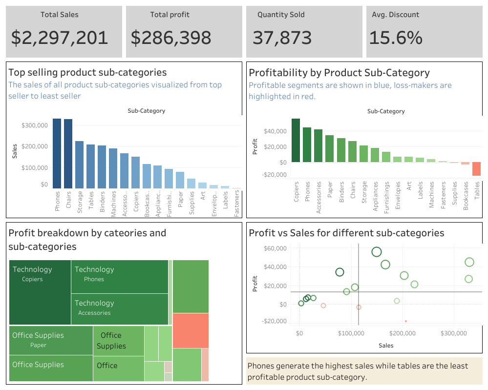
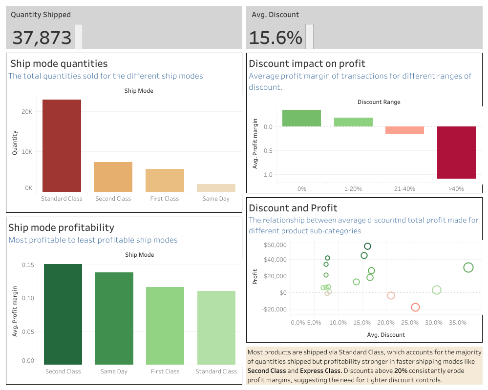
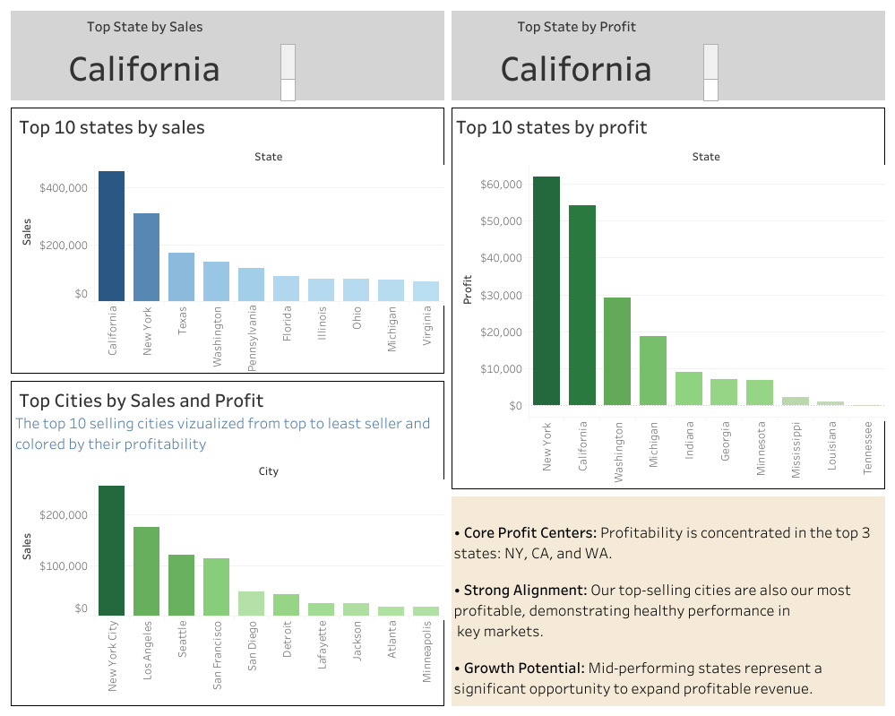

# 📊 Sample Superstore Sales & Profit Analysis Project  

This project analyzes sales and profit performance across product categories and sub-categories, shipping modes, and geographic regions using **Google sheets** for cleaning, validation and standardization of the dataset and then **Tableau** for vizualization.  
The goal is to uncover actionable insights and provide recommendations to improve profitability and business performance.  

---

## 🔑 Key Insights  
1. **Phones are the strongest revenue and profit driver**  
   - Generated the highest sales (over $300,000) and contributed significantly to profitability.  

2. **Tables generate strong sales but incur losses**  
   - Despite ranking among the top-selling sub-categories, Tables recorded a net loss of nearly $20,000, highlighting pricing inefficiencies or cost pressures.  

3. **Technology dominates profit contribution**  
   - Sub-categories such as Copiers, Phones, and Accessories account for the bulk of total profit.  
   - Certain Furniture and Office Supplies (e.g., Tables, Bookcases) drag margins down.  

4. **Shipping mode impact**  
   - Standard Class dominates shipments, but faster modes like Second Class and Same Day yield stronger profit margins.  

5. **Discounting strategy weakens profitability**  
   - Profitability turns negative when discounts exceed 20%. Lower discount ranges maximize margins, underscoring the need for tighter discount controls.  

6. **Geographic performance**  
   - California leads in revenue, while New York leads in profitability.  
   - Growth opportunities exist in mid-tier states, where scaling can boost overall profit.  

---

## 💡 Recommendations  
- **Strengthen Technology Portfolio**: Continue investing in Phones, Copiers, and Accessories, which represent the most profitable growth avenues.  
- **Address Loss-Making Products**: Reassess pricing and discount strategies for Tables and Bookcases. Explore cost optimization or vendor renegotiation.  
- **Refocus Resources**: Shift resources from underperforming categories toward high-margin sub-categories.  
- **Tighten Discount Controls**: Implement discount thresholds and review policies to prevent margin erosion.  
- **Optimize Shipping Strategies**: Promote cost-efficient shipping without compromising profitability.  
- **Expand in Mid-Tier States**: Target states with untapped growth potential to diversify profitability beyond top regions.  

---

## 📂 Repository Contents  
- **docs/**  
  - [Sample Superstore Sales & Profit Analysis Project (PDF)](./docs/Sample_Superstore_Sales_&_Profit_Analysis_Project.pdf) 
- **dashboards/**  
  - [Sample Superstore Workbook (TWBX)](./dashboards/Sample_Superstore_Workbook.twbx)  
- **data/**  
  - [Sample Superstore Cleaned (XLSX)](./data/Sample_Superstore_Cleaned.xlsx)  
  - [Sample Superstore Raw (XLSX)](./data/Sample_Superstore_Raw.xlsx)  
- **images/**  
  - Dashboard preview screenshots (see below)  

---

## 📸 Dashboard Previews  

### Sales & Profit Overview  
  

### Shipping & Discount Analysis  
  

### State & City Performance  
  

---

## 📈 Next Steps (Planned Enhancements)  
- Incorporate **time-series data** for trend analysis.  
- Extend dashboards to include **customer-level metrics**.  
- Automate reporting for **recurring decision support**.  

---

## 👤 Author  
**Kelvin Chukwuneke**  
- 📧 Email: *kahjoc@gmail.com*  
- 🔗 [LinkedIn](https://www.linkedin.com/in/your-linkedin)  
- 🐙 [GitHub Profile](https://github.com/yourusername)  

---
⭐ If you found this project interesting, consider giving it a star on GitHub!
